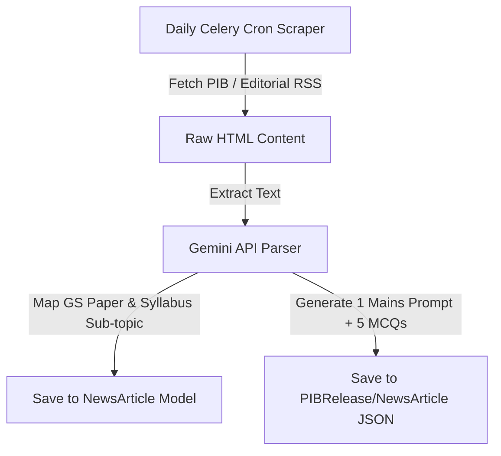

# UPSC Feature Proposals & Implementation Guide

This document outlines planned improvements and new feature modules specifically tailored for the UPSC Civil Services Examination (CSE) preparation section of PrepUp.

---

## 1. ✍️ UPSC Mains Answer Evaluator (GS I-IV & Optionals)

### Description
Subjective answer writing is the core of the UPSC Mains examination. This feature provides a self-evaluating workspace where candidates can write answers to Mains questions and receive granular, structured AI grading.

### Technical Architecture
- **API Endpoint**: `POST /api/upsc/mains/evaluate/`
- **Database Model additions**:
  ```python
  class MainsQuestion(models.Model):
      id = models.UUIDField(primary_key=True, default=uuid.uuid4)
      gs_paper = models.IntegerField(choices=[(1, 'GS-I'), (2, 'GS-II'), (3, 'GS-III'), (4, 'GS-IV')])
      syllabus_topic = models.CharField(max_length=500)
      question_text = models.TextField()
      model_answer = models.TextField()
      key_points = models.JSONField(help_text="Expected keywords, articles, or cases")

  class MainsEvaluation(models.Model):
      user = models.ForeignKey(User, on_delete=models.CASCADE)
      question = models.ForeignKey(MainsQuestion, on_delete=models.CASCADE)
      user_answer = models.TextField()
      intro_score = models.IntegerField(help_text="Out of 10")
      body_score = models.IntegerField(help_text="Out of 10")
      conclusion_score = models.IntegerField(help_text="Out of 10")
      structure_score = models.IntegerField(help_text="Out of 10")
      factual_feedback = models.JSONField(help_text="List of missing articles/amendments/data")
      structural_feedback = models.TextField()
      evaluated_at = models.DateTimeField(auto_now_add=True)
  ```

### Evaluation Prompts (Gemini Integration)
The backend routes calls to Google Gemini using structured schemas. The system instructs the model to evaluate the candidate's answer based on:
1.  **Relevance**: Did the answer address the specific directive (Critically Analyze, Discuss, Evaluate)?
2.  **Syllabus Facts**: Did it cite relevant constitutional articles, Supreme Court cases, or commission reports?
3.  **Flow**: Is there a logical progression from introduction to body and balanced conclusion?

---

## 2. 📰 Daily PIB & Editorial Syllabus-Mapper

### Description
PIB releases and newspaper editorials are critical for current affairs, but candidates struggle to connect articles to the vast UPSC syllabus. This feature automates daily news scraping, summarizes articles, maps them to syllabus sections, and generates active practice content.

### Scraper and AI Processing Pipeline


### Key UI Sub-components
*   **Syllabus Filters**: A tabbed list displaying GS-I, GS-II, GS-III, GS-IV cards. Clicking a paper highlights all scraped news articles from the last 7 days matching that paper.
*   **Active Recall Sidebar**: While reading a summarized news release, candidates can click a "Test Me" button to open the AI-generated MCQs based on the article facts, or click "Write Answer" to open the Mains Answer Evaluator with a prompt directly inspired by that news event.

---

## 3. 🗺️ Map Master AI (Geography & Places in News)

### Description
Geography mapping questions carry significant weight in the Prelims. This module turns static map practice into an interactive, AI-driven learning game using topographical maps.

### Geopolitical Mapping Workflows
1.  ** geoguesser Mode**: The AI gives a geopolitical hint (e.g., *"This port city in the Middle East has been central to recent trade corridor negotiations."*). The candidate must pinpoint the correct location on the interactive svg map.
2.  **Physical Geography Layers**: Candidates trace major rivers (e.g., Ganga, Indus, Brahmaputra tributaries) or locate National Parks and biosphere reserves.
3.  **Active Progress Stats**: Tracks accuracy rate across continents and oceans, feeding data into the main [Analytics Dashboard](file:///home/dspratap/Downloads/PrepUp/frontend/client/src/pages/analytics-dashboard.tsx).
